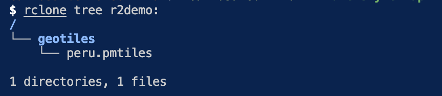

# Working with Protomaps
## Create a tileset
### Getting Started
Install [pmtiles](https://formulae.brew.sh/formula/pmtiles) 

Find the recently [OSM data](https://maps.protomaps.com/builds/)

Use [klokantech](https://boundingbox.klokantech.com/) or [bboxfinder](http://bboxfinder.com/) to choose your bbox or extract them from the topojson layer called *bbox*. 

Then extract the area of Perú for example.
```
pmtiles extract https://build.protomaps.com/20240822.pmtiles peru.pmtiles --bbox=-81.32810348999999,-18.349025360999974,-68.65308935299998,-0.03860596899994562
```

View recent pmtiles file in [maps](https://maps.protomaps.com).

### Cloud Storage for PMTiles
Use a r2 bucket from cloudfare to storage the PM tile. Here we will use S3-compatible storage with a tool called `rclone`. There another way using **workers**.

Create your r2 bucket called `geotiles` in UI cloudfare.

Due tiles are big files, you must install the cli tool called *rclone*. Read Full documentation [here](https://developers.cloudflare.com/r2/examples/rclone/). 
```
brew install rclone
```
Then generate your R2 API tokens `access_key_id` and `access_key_secret`.

Edit config `rclone.conf` file with the id, secret and endpoint. Go to vim /Users/carlosalbertoleonliza/.config/rclone/rclone.conf. 
```
 [r2demo]
type = s3
provider = Cloudflare
access_key_id = abc123
secret_access_key = xyz456
endpoint = https://<accountid>.r2.cloudflarestorage.com
acl = private
no_check_bucket = true
```

Upload your the tile to your bucket called `geotiles` in cloudfare.
```
rclone copy peru.pmtiles r2demo:geotiles
```

Go to cloudfare R2 UI to see the uploaded tile or look it from the command line . 
```
rclone tree r2demo:
```



Or using `show` command with the R2 storage `Public R2.dev Bucket URL` 
```bash
pmtiles show https://pub-d38145745fe247a1b3acb61ef28034c6.r2.dev/peru.pmtiles
```

Or using `show` command with environment variables and endpoints.
```bash
export AWS_ACCESS_KEY_ID=MY_KEY
export AWS_SECRET_ACCESS_KEY=MY_SECRET
pmtiles show peru.pmtiles --bucket=s3://geotiles\?endpoint=https://a7a8d6fc7e011ba0a1eb32259515cde6.r2.cloudflarestorage.com\&region=auto
```

For security purposes go to your bucket settings *CORS Policy* and configure your `Allowed Origins`. Use this template.
```bash
{
  "AllowedOrigins": [
    "http://localhost:5173",
    "http://localhost:4173",
    "https://ccalobeto.github.io"
  ],
  "AllowedMethods": [
    "GET",
    "HEAD"
  ],
  "AllowedHeaders": [
    "range",
    "if-match"
  ],
  "ExposeHeaders": [
    "etag"
  ],
  "MaxAgeSeconds": 3000
}
```

### Using the Bucket URL in your project
Once your *pmtiles* file is uploaded, go to your bucket settings *Public access/R2.dev subdomain*, copy the `Public R2.dev Bucket URL` and use it as a basemap in your project.

### References
1. [A script to create a bucket and upload a file with `@aws-sdk/client-s3` library.](https://www.youtube.com/watch?v=6Y_clyTpmAk)

## Publishing a pmtile with MapLibre
### Basemaps for MapLibre
For a basemap you need: 
- tileset
- style
- fontstack or glyphs
- spritesheets or themes

MapLibre styles are JSON documents.

### Setup
#### Use [maps](https://maps.protomaps.com/) tool
Upload your pmtile into the tool and go to the address bar to get the zoom level and coordinates. You will use it as a initial calibration when you create an instance of the map with MapLibre. 

Then select the `theme` and `get style json` to copy the clipboard.

#### Save the file
Save the file in the path `static/data/styles/<filename>.json` and update the `url` key with the `Public R2.dev Bucket URL` which is the location of your pmtile in *cloudfare*.

#### Use
Go to your `+page.svelte` import the style and use it when you create the instance.

#### Use a package
You can use `protomaps-themes-base` package. [Review](https://docs.protomaps.com/basemaps/maplibre)